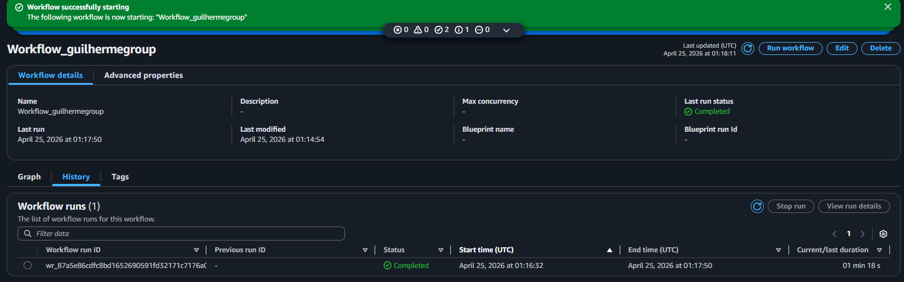

## Guilherme Group: Unified Data Pipeline (AWS Edition)

## Aviso de Privacidade e Origem dos Dados
**Nota Importante: Todos os dados utilizados neste projeto (nomes, CPFs, e-mails e transações) foram gerados de forma artificial utilizando a biblioteca Faker do python. Qualquer semelhança com nomes, pessoas ou dados da vida real é mera coincidência. Este ambiente foi construído estritamente para fins de demonstração técnica e estudo de engenharia de dados.**

## Sobre o Projeto:

Esse sistema integra duas holdings (Nexus Tech e Nexus Retail) a um único ambiente na nuvem (Cloud), tornando muito mais rápido, automático e seguro captar e cruzar os dados entre as empresas.

Em vez de cada setor sofrer com planilhas soltas, manuais e sujeitas a erros, este projeto cria uma "fábrica de dados" que recebe as informações brutas, limpa, valida e entrega relatórios prontos e confiáveis para a tomada de decisão.

## O Problema que Resolvemos
Antes, para saber quanto a empresa faturou ou quanto um vendedor deveria receber de comissão, era necessário cruzar dezenas de arquivos manualmente. Isso gerava atrasos, informações duplicadas e risco de cálculos errados.

Agora, o sistema faz tudo sozinho e em segundos.

## O Que Cada Setor Ganha Com Isso? (Entregas do Sistema)

**Para o RH (Gestão de Pessoas)**
Sem cálculos manuais: O sistema já cruza as vendas e entrega uma tabela pronta com o total vendido por cada funcionário e o valor exato da comissão de 5% que deve ser paga.

Segurança: O sistema tem travas de segurança. Se uma venda entrar no sistema sem o "ID do Vendedor", ele bloqueia a operação e avisa o erro, garantindo que ninguém fique sem receber.

Entrega Automatizada (Arquivo CSV): O setor recebe automaticamente um arquivo CSV isolado e validado, contendo apenas a folha de comissões pronta para ser processada, sem necessidade de intervenção humana.

-------------------------------------------------------------------------

**Para o Financeiro**
Receita Clara: Um relatório diário mostrando o Faturamento Bruto e o Custo total, unindo o que foi vendido tanto na área de Tecnologia quanto no Varejo.

Auditoria: O sistema barra automaticamente vendas com valores negativos ou zerados, garantindo que o balanço financeiro seja 100% real.

Entrega Automatizada (Arquivo CSV): Geração diária de um arquivo CSV de conciliação financeira, entregando os dados blindados e prontos para integração direta com o ERP da holding.

**Para a Diretoria e Marketing**
Ranking de Sucesso: Uma visão direta de quais produtos (como PCs Gamers ou Consultorias de TI) estão saindo mais, ajudando a focar os investimentos e as campanhas de marketing no que realmente dá lucro.

Entrega Automatizada (Arquivo CSV): Exportação de um relatório executivo em CSV com os KPIs consolidados, pronto para alimentar os painéis de Dashboard (BI) da diretoria.

## Como Funciona o sistema?
O processo funciona como uma esteira de produção automatizada dividida em **4 fases:**

**Recepção (Raw):** Recebemos os arquivos brutos das vendas de cada empresa na nossa nuvem.

**Tratamento (Processamento):** Um robô lê linha por linha. Ele limpa CPFs digitados errados, corrige formatos de data e aplica testes rigorosos de qualidade (ex: o valor unitário multiplicado pela quantidade tem que bater exatamente com o valor total).

**Vitrine (Gold Zone):** Os dados aprovados são empacotados em um formato super leve e rápido, sendo separados em pastas específicas com governança de dados. O RH só tem acesso aos dados de RH, e o Financeiro só aos dados do Financeiro.

**Distribuição (Exportação CSV):** Na ponta final da esteira, o sistema converte os dados aprovados da Vitrine em relatórios .csv segmentados e os disponibiliza automaticamente para download de cada departamento

**Vitrine (Gold Zone):** Os dados aprovados são empacotados em um formato super leve e rápido, sendo separados em pastas específicas. O RH só tem acesso aos dados de RH, e o Financeiro só aos dados do Financeiro.

## Autor
Guilherme
