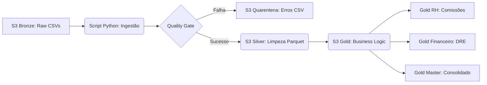
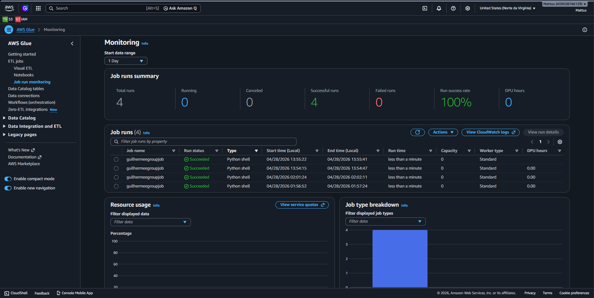
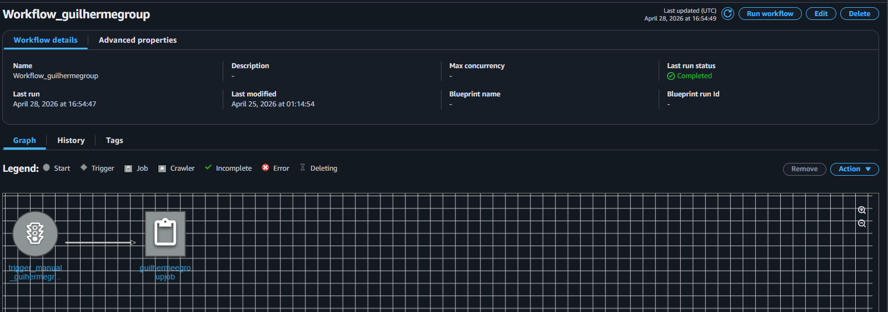
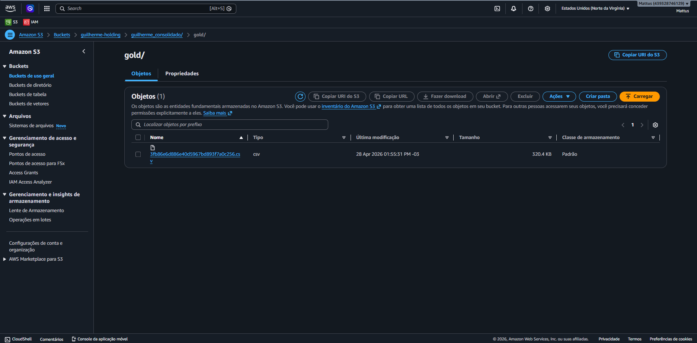

#  Unified Data Pipeline


## Aviso de Privacidade e Origem dos Dados
 Nota Importante: Todos os dados utilizados neste projeto (nomes, CPFs, e-mails e transações) foram gerados de forma artificial utilizando a biblioteca Faker do python. Qualquer semelhança com nomes, pessoas ou dados da vida real é mera coincidência. Este ambiente foi construído estritamente para fins de demonstração técnica e estudo de engenharia de dados.


## Sobre o Projeto:

Autor: Guilherme Coradini

LinkedIn: https://www.linkedin.com/in/guilherme-coradini-7607883ab/

Status do Projeto: v2.0

## Por que este projeto? 
Este pipeline foi desenvolvido para resolver o desafio de consolidar dados transacionais de múltiplas holdings (Nexus Tech e Nexus Retail). O objetivo é garantir que dados brutos e heterogêneos sejam transformados em informações financeiras confiáveis, utilizando uma arquitetura escalável na nuvem (AWS) e aplicando rigorosos Quality Gates para evitar que erros de processamento cheguem à camada de decisão.

## Arquitetura e Fluxo de Dados
O projeto segue a Medallion Architecture, garantindo a linhagem e a qualidade dos dados em cada etapa:

Bronze (Raw): Ingestão de dados String-Only para garantir que nenhuma informação seja perdida por tipagem incorreta.

Silver (Processed): Limpeza, tipagem correta, tratamento de nulos e aplicação de filtros de qualidade.

Gold (Analytics): Agregação financeira (DRE simplificada) pronta para consumo em dashboards.




## Tecnologias Utilizadas
**Python 3.10+ (Pandas, Numpy)**

**Parquet (Armazenamento colunar eficiente)**

**Faker (Geração de dados sintéticos reprodutíveis)**

## Como Executar (Reprodutibilidade)

1. Clonar e Configurar

```bash
git clone https://github.com/Mattustk/Unified-Pipeline-Cloud.git
cd Unified-Pipeline-Cloud
pip install -r requirements.txt
```

2. Gerar Dados de Teste
Para garantir a reprodutibilidade, utilize o script de semente fixa:

```bash
python src/generate_data.py
```
Isso criará os arquivos tech_nexus.csv e retail_nexus.csv na pasta data/raw/ com dados consistentes.

3. Rodar o Pipeline

```bash
python src/pythonmain.py
```

##  Evidências de Execução (AWS Cloud)

Para validar a robustez e a escalabilidade do pipeline, o projeto foi implantado e executado com sucesso no ambiente AWS utilizando Glue Jobs e Workflows.

### 1. Monitoramento de Jobs (Success Rate)

*Figura 1: Tabela de monitoramento comprovando 4 execuções consecutivas com sucesso (Sucedido).*

### 2. Orquestração via Workflow

*Figura 2: Fluxo de trabalho (Workflow) orquestrado e finalizado sem erros.*

### 3. Persistência na Camada Gold (Parquet)

*Figura 3: Camada Gold consolidada no Amazon S3, armazenada em formato Parquet para alta performance analítica.*

