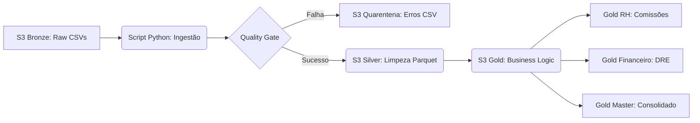

#  Unified Data Pipeline (AWS Edition)


## Aviso de Privacidade e Origem dos Dados
**Nota Importante: Todos os dados utilizados neste projeto (nomes, CPFs, e-mails e transações) foram gerados de forma artificial utilizando a biblioteca Faker do python. Qualquer semelhança com nomes, pessoas ou dados da vida real é mera coincidência. Este ambiente foi construído estritamente para fins de demonstração técnica e estudo de engenharia de dados.**


## Sobre o Projeto:

Unified Pipeline Cloud v2.0 — Medallion Architecture
Este projeto implementa um pipeline de dados unificado na AWS para processamento de múltiplas holdings (Nexus Tech e Nexus Retail), seguindo rigorosamente a Arquitetura Medalhão (Bronze, Silver e Gold) e os princípios de Data Lakehouse da Databricks.

Evolução v2.0 (The "Audit" Update)
Após feedback técnico, o projeto foi refatorado para transcender o ETL básico, focando em Governança e Resiliência:

Qualidade de Dados (Quality Gates): Implementação de validação cruzada (Preço * Qtd == Total). Registros inconsistentes são desviados para uma Quarentena, garantindo que a camada Gold seja 100% íntegra.

Observabilidade: Substituição de prints por Logging Estruturado. Todo o fluxo é rastreável, facilitando o debug em produção.

Modularização: Código estruturado em funções reutilizáveis, reduzindo a repetição e facilitando a manutenção (Padrão Don't Repeat Yourself - DRY).

Schema Enforcement: Proteção contra quebra de tipos na ingestão Bronze, tratando dados brutos como strings antes da tipagem rigorosa na Silver.


##  Fluxo de Dados (Arquitetura)



##  Tecnologias Utilizadas

* **Python 3.11**
* **AWS S3** (Armazenamento Distribuído)
* **AWS DataWrangler** (Integração otimizada com S3)
* **Pandas** (Motor de transformação)
* **Logging** (Monitoramento de pipeline)

##  Como Executar (Quick Start)

1. **Instale as dependências:**
```bash
pip install pandas awswrangler boto3
```
Execute o Pipeline:
```bash
python main.py
```

## Autor
Guilherme
